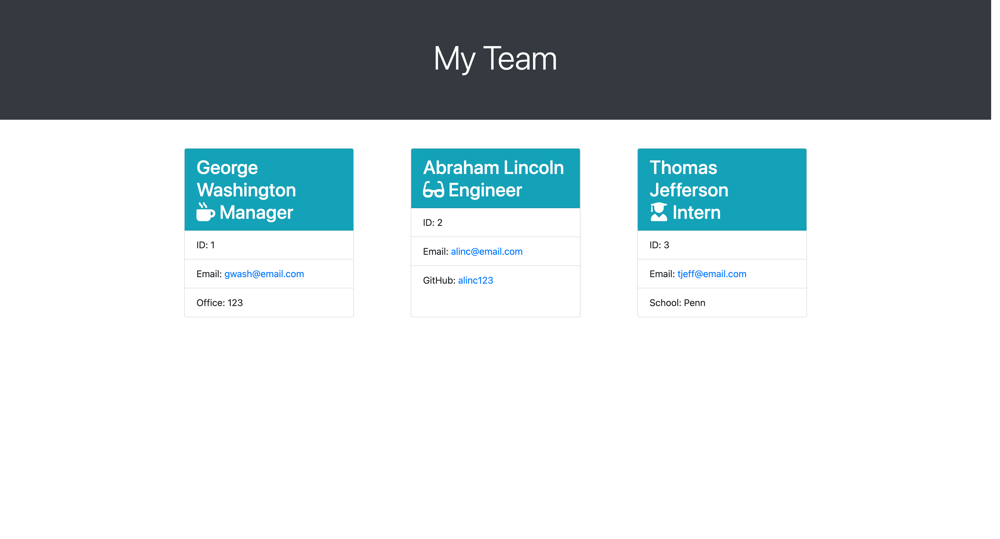

# node-team-profile-generator

## Description

This is an application powered by Node.js that uses a series of user prompts to generate a web page that displays members of a software engineering team and their contact information. An app like this is beneficial for a team manager to have quick access to all their teammates' contact information, such as their emails and GitHub profiles.

## Table of Contents

- [Installation](#installation)
- [Tests](#tests)
- [Usage](#usage)
- [Credits](#credits)
- [License](#license)
- [Links](#links)
- [Screenshots](#screenshots)

## Installation

To run a copy of this app on your local machine, first clone the repository:

HTTPS:

```
$ git clone https://github.com/liaobrien/node-team-profile-generator.git
```

SSH:

```
$ git clone git@github.com:liaobrien/node-team-profile-generator.git
```

Then cd into the cloned directory, and enter the following command to initialize the app:

```
$ node index.js
```

## Tests

To run the tests of this application, enter the following command:

```
$ npm run test
```

## Usage

This app is meant to be used in the command line. After entering the initializing Node command, the user is first prompted with questions regarding the manager's information such as name, ID number, email, and office number. Once those are complete, a list prompt appears where the user can decide if they want to add an engineer or intern to their team roster, and answer questions about their respective information. Once the user is done adding teammates, they can select "I'm Done" from the list options, and a styled index.html file is automatically generated in the output directory.

## Credits

The Node packages [Inquirer](https://www.npmjs.com/package/inquirer) and [Jest](https://www.npmjs.com/package/jest) were installed for this application.

## License

This project is licensed under the MIT license.

## Links

A demo of the application can be viewed [here](https://youtu.be/3gO_mjmff3Y).

## Screenshots

An example of an HTML file generated by this application:

